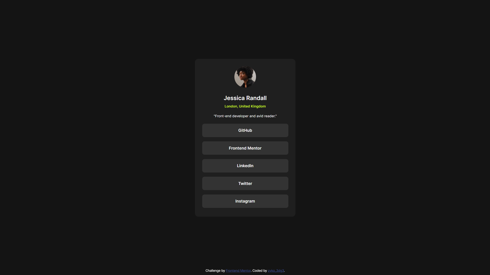

# Frontend Mentor - Social links profile solution

This is a solution to the [Social links profile challenge on Frontend Mentor](https://www.frontendmentor.io/challenges/social-links-profile-UG32l9m6dQ). Frontend Mentor challenges help you improve your coding skills by building realistic projects.

## Table of contents

- [Overview](#overview)
    - [The challenge](#the-challenge)
    - [Screenshot](#screenshot)
    - [Links](#links)
- [My process](#my-process)
    - [Built with](#built-with)
    - [What I learned](#what-i-learned)
    - [Continued development](#continued-development)
- [Author](#author)

## Overview

### The challenge

Users should be able to:

- View the optimal layout depending on their device's screen size

- See hover and focus states for all interactive elements on the page

### Screenshot

### Links

- Solution URL: [Solution]()

- Live Site URL: [Live Site]()

## My process

### Built with

- Semantic HTML5 markup
- Flexbox
- Mobile-first workflow

### What I learned

- This project helped me strengthen my understanding of flexbox alignment and responsive design.

- I also practiced using hover effects to make the buttons more interactive and user-friendly.

- Example of a simple hover effect I used:

.social-link-container > a:hover {
  background-color: hsl(75, 94%, 57%);
  cursor: pointer;
  color: hsl(0, 0%, 8%);
}

### Continued development

I plan to experiment with CSS Grid to create more complex layouts.

### Author

- Frontend Mentor - [@zvko-3dg3](https://www.frontendmentor.io/profile/zvko-3dg3)

- GitHub - [@zvko-3dg3](https://github.com/zvko-3dg3)